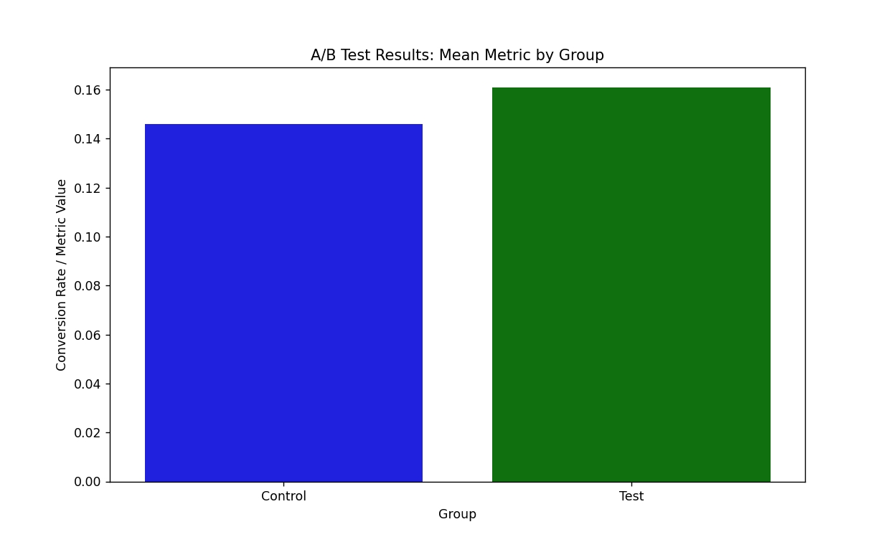

# A/B Test Analyzer

## Описание

Этот скрипт — инструмент для анализа A/B-тестов на Python. Он проводит статистические тесты, рассчитывает метрики и визуализирует результаты.

**Поддерживаемые функции:**
- Z-тест для пропорций.
- T-тест для средних.
- Bootstrap для ненормальных распределений.
- Обработка выбросов.
- Расчёт метрик: mean, std, N по группам.
- Power analysis: рекомендуемый размер выборки.
- Bar-chart визуализация.

## Требования

- **Python:** 3.8 или выше.
- **Библиотеки:** Установите через pip:

`pip install -r requirements.txt`.

### Обязательная структура
- **Колонки:** Минимум `'group'` и `'conversion'`.
  - `group` (str): `'control'` или `'test'` (ровно 2 уникальных значения, баланс ~50/50).

**Правила:**
- Нет NaN в ключевых колонках (скрипт удалит, но если всё пусто — ошибка).
- Минимум 100+ строк на группу для значимых результатов.
- Формат: UTF-8, без индекса, заголовки без пробелов.
- Если групп <2 или колонок нет — ошибка: "CSV файл существует, но данные неверные".

### Пример CSV

| group   | conversion | revenue |
|---------|------------|---------|
| control | 0          | 95.2    |
| control | 1          | 150.0   |
| test    | 0          | 105.1   |
| test    | 1          | 160.5   |
| control | 1          | 120.3   |
| test    | 0          | 98.7    |

## Установка и запуск

1. Скачайте `ab_test.py` и `requirements.txt`.
2. Положите CSV в папку.
3. Установите зависимости (см. выше).
4. Настройте параметры в начале `ab_test.py`:
`csv_filename` `mde` `alpha` `power` `control_col` `metric_col` `control_group_name` `test_group_name`
5. При необходимосте, настройте обработку выбросов.
5. Запустите:
`python ab_test.py`

## Параметры

| Параметр           | Описание                                  |
|--------------------|-------------------------------------------|
| csv_filename       | Путь к CSV                                |
| mde                | Минимальный эффект                        |
| alpha              | p < alpha = значимо                       |
| power              | Вероятность детекции                      |
| control_col        | Название колонки с группой                |
| metric_col         | Название колонки с метрикой               |
| control_group_name | Название контрольной группы               |
| test_group_name    | Название тестовой группы                  |

### Обработка выбросов

| Параметр          | Описание                                       | Значения                      |
|-------------------|------------------------------------------------|-------------------------------|
| handle_outliers   | Включить обработку выбросов                    | True / False                  |
| outlier_method    | Метод детекции                                 | "IQR", "zscore", "percentile" |
| outlier_threshold | Порог для IQR (1.5) или z-score (3.0)          | float (1.5, 3.0)              |
| outlier_action    | Действие с выбросами                           | "remove", "winsorize"  |
| percentile_lower  | Нижний процентиль (для метода percentile)      | 1-5                           |
| percentile_upper  | Верхний процентиль (для метода percentile)     | 95-99                         |

**Методы:**
- `IQR`       : Межквартильный размах, удаляет значения за Q1-1.5×IQR и Q3+1.5×IQR
- `zscore`    : Удаляет значения с |z| > threshold (обычно 3)
- `percentile`: Удаляет значения ниже/выше заданных процентилей

**Действия:**
- `remove`    : Удаляет строки с выбросами
- `winsorize` : Заменяет выбросы на граничные значения

**Важно:** Обработка выбросов применяется только к **непрерывным метрикам**. Для бинарных метрик скрипт автоматически пропускает обработку, так как IQR/z-score не имеют смысла для таких данных.

## Пример вывода

Параметры: CSV=sample_data.csv, MDE=0.02, alpha=0.05, power=0.8
Загружено строк: 10000, колонки: ['group', 'conversion', 'revenue']
Метрика 'conversion' бинарная (0/1) — обработка выбросов пропущена.

Обработка выбросов: выбросов не обнаружено (метод: IQR).

Тип метрики 'conversion': binary

БАЗОВЫЕ МЕТРИКИ ПО ГРУППАМ:
          Mean    Std         N
control 0.1460 0.3531 5000.0000
test    0.1610 0.3676 5000.0000

Z-ТЕСТ (для пропорций):
  p-value: 0.03747 (H0 отвергнута), alpha=0.05
  Uplift: +10.27% (Test: 0.161, Control: 0.146)
  Вывод: Разница статистически значима!

T-ТЕСТ (для средних):
  p-value: 0.03747 (Значимый (отклоняем H0), alpha=0.05)
  Effect size: 0.0416 (Test: 0.161, Control: 0.146)
  Рекомендация: Разница значима — тест лучше.

POWER ANALYSIS (мощность 80.0%, alpha=0.05):
  Рекомендуемый размер выборки: 39246 на группу (для MDE=0.02)
  Текущая выборка (5000.0 в тест-группе) мала для MDE=0.02 — рискуем пропустить эффект. Соберите больше данных.

## 

В качестве примера взял датасет с Kaggle и проверил на нём работу скрипта.

## Ограничения

- Визуализация: Лучше в IDE/Jupyter (терминал может не показать).
- Для больших данных (>1M строк): Увеличьте память или семплируйте.

---

[Связаться со мной](mailto:ar.al.nosov@gmail.com)
